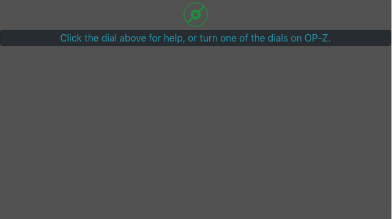
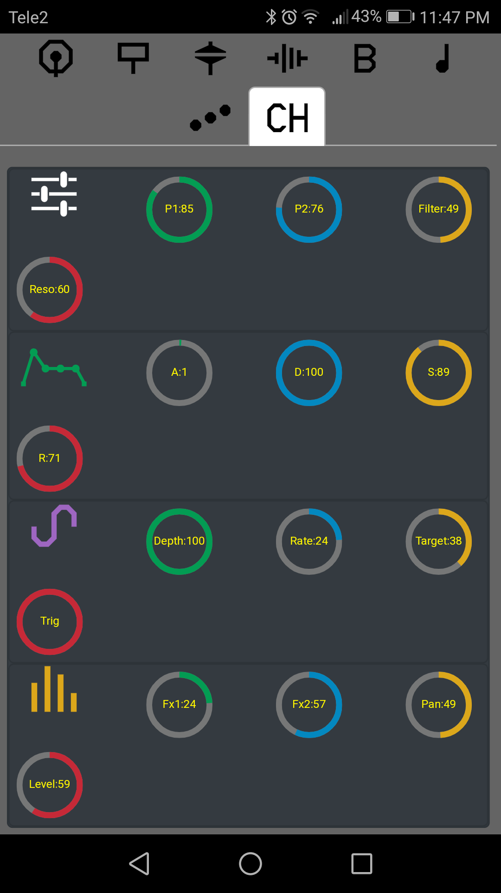

# Release Notes

## version 1.0
### Date:
2019-02-27
### Summary:
1) Added icons for tracks and parameters.
2) All the tracks have a separate tab, user can access the track information by selecting selecting the track tab.
3) App detects play/stop mode, and prevents switching the track information during play.
4) Layout improvements. 

### Screenshots: 
 1) 
 2) 
 3) 

### Demo
 YoutubeLink: 

